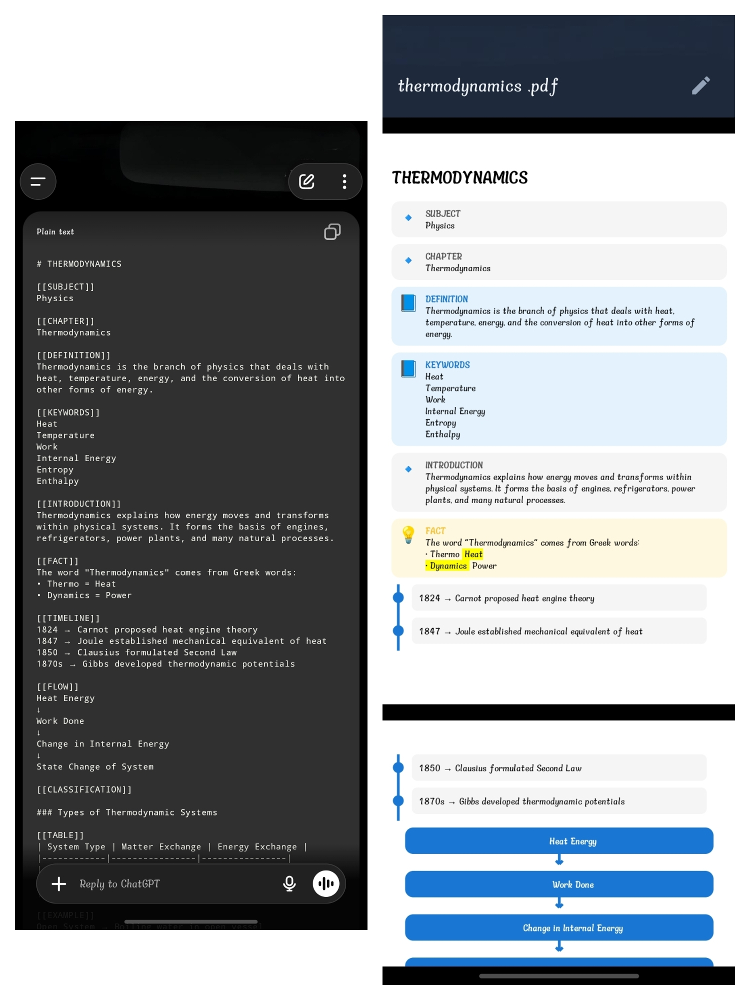
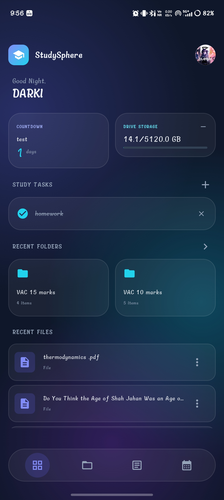
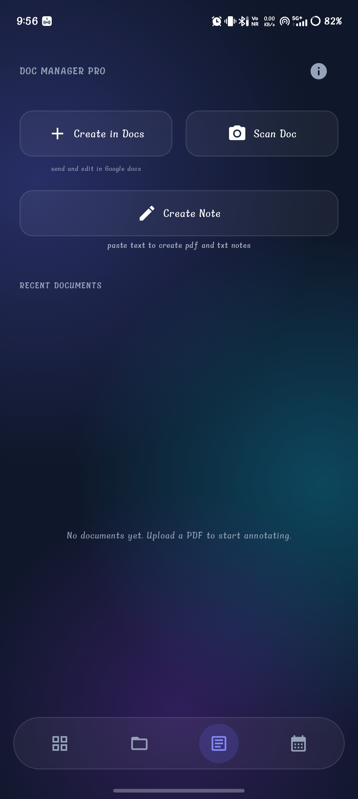
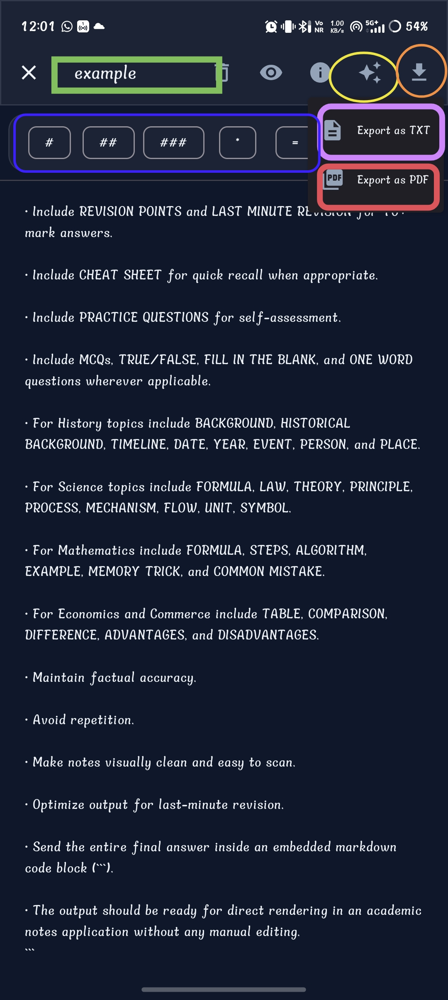
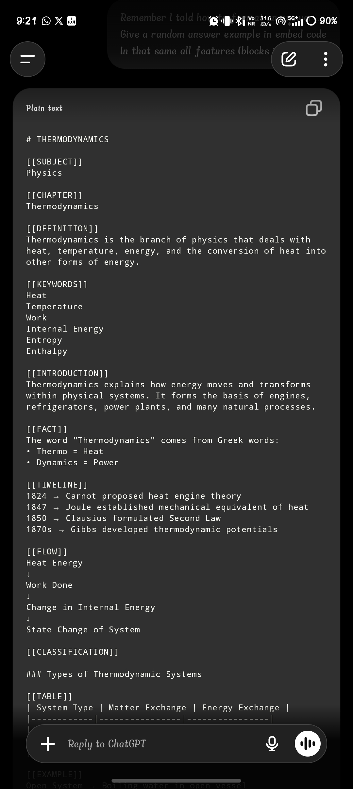

# 🌌 Study Sphere
**Turn Raw AI Text into Beautiful, Revision-Ready Study Notes in Seconds.**

> **Study Sphere** is a next-generation academic note-taking application designed to parse standard Markdown text from AI (like ChatGPT or Gemini) and instantly render it into highly structured, visually engaging UI blocks.

[Download .apk](#download--installation) • [How It Works](#-the-magic-workflow) • [Core Features](#-core-features) • [Feedback](#-contact--feedback)

---

## ⚡ The Magic Workflow

Stop reading boring walls of text. Study Sphere uses a highly optimized Master Prompt to force AI to format its answers perfectly for our engine. 

1. **📋 Copy the Prompt:** Grab the official Study Sphere Master Prompt from our app or website.
2. **🤖 Ask Your AI:** Paste the prompt into ChatGPT or Gemini, followed by your study topic (e.g., *"Thermodynamics 15 marks"*).
3. **✨ Paste & Render:** Copy the AI's response, paste it into the Study Sphere Editor, and watch it instantly transform into a beautiful, color-coded study module.

---

## 🚀 Core Features

* **🎨 70+ Rich Embedded Blocks:** Automatically renders `[[FACT]]`, `[[FORMULA]]`, `[[MEMORY TRICK]]`, `[[EXAM TIP]]`, and dozens more into gorgeous UI elements.
* **🧠 Built for Visual Revision:** Color-coded warning/caution boxes and structured timelines help your brain digest and memorize complex concepts faster.
* **📄 Instant PDF Export:** Turn your dynamic modules into clean, printable PDFs to study offline or share with classmates.
* **🗂️ Smart Library & Cloud Sync:** Keep all your subjects organized in folders, securely backed up to your Google Drive.
* **⏱️ Academic Dashboard:** Track upcoming exams with countdown timers, manage daily tasks, and jump straight back into your recent files.

---

## 📱 App Screenshots

  
  
  
  

---

## 📥 Download & Installation

Study Sphere is currently in active development for Android devices.

**[👉 Click here to visit our website and download the latest .apk](https://studysphereapp.github.io/)**

*Note: Because the app is not yet published on the Google Play Store, your Android device may display a standard "File might be harmful" warning. It is 100% safe to tap "Download anyway" to proceed.*

---

## 🎯 Target Audience

- **Students:** Ace your exams with perfectly structured summaries, cheat sheets, and practice questions.
- **Educators:** Generate gorgeous handouts, study guides, and lesson plans effortlessly.
- **Researchers:** Organize findings, case studies, and historical timelines into readable formats.

---

## 🤝 Contact & Feedback

Study Sphere is constantly evolving, and your feedback is vital to shaping the future of academic organization. 

* 💬 **WhatsApp Community:** [Join the Channel](https://whatsapp.com/channel/0029VbCL8qz42Dcm7GKuGF3N)
* ✈️ **Telegram:** [@Studysphereapp](https://t.me/Studysphereapp)
* 📸 **Instagram:** [@darki0047](https://instagram.com/darki0047/)
* 📧 **Email:** nurislam76898@gmail.com

---

  
<i>Crafted with ❤️ for students, by students.</i>

